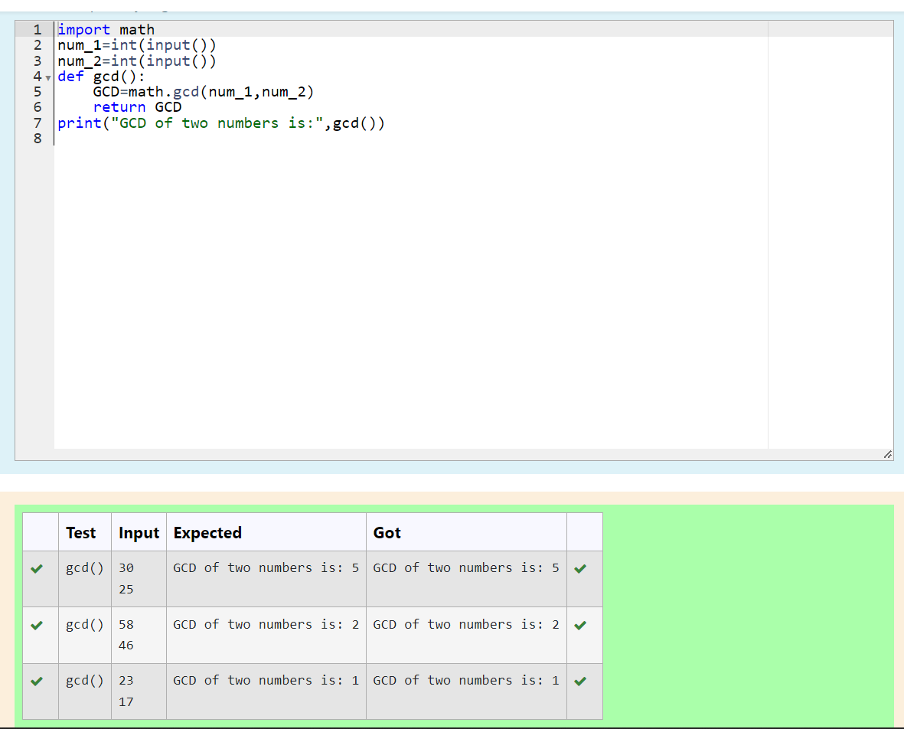

# Find the GCD of two numbers

## AIM:
To write a program to find the GCD of two numbers using function.

## Equipments Required:
1. Hardware – PCs
2. Anaconda – Python 3.7 Installation / Moodle-Code Runner

## Algorithm
1. Define a function.
2. Get the two numbers from the user.
3. Compare the two values, to find the smaller number.
4. Use for() and if() loop to find the GCD of the two numbers.

## Program:
```python
/*
Program to find the gcd of two number using function.
Developed by:Shakthi kumar S 
RegisterNumber: 22009242
*/
import math
num_1=int(input())
num_2=int(input())
def gcd():
    GCD=math.gcd(num_1,num_2)
    return GCD
print("GCD of two numbers is:",gcd())
```

## Output:




## Result:
Thus the program to find the GCD of two numbers is written and verified using python programming.
